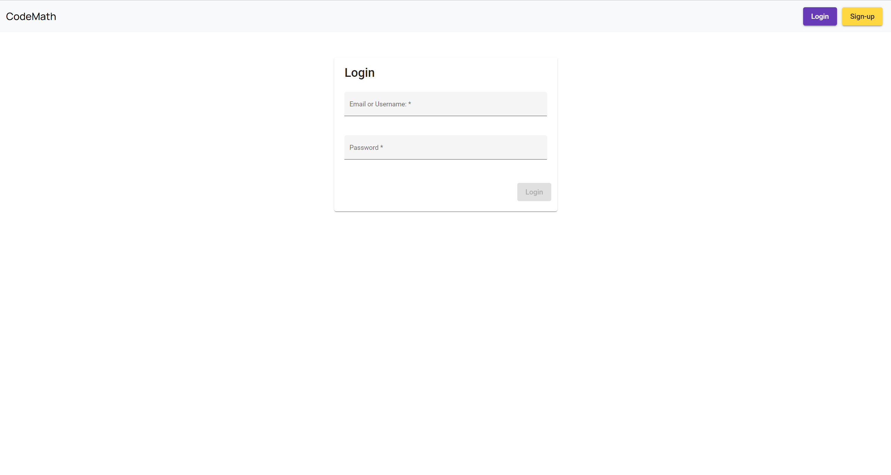
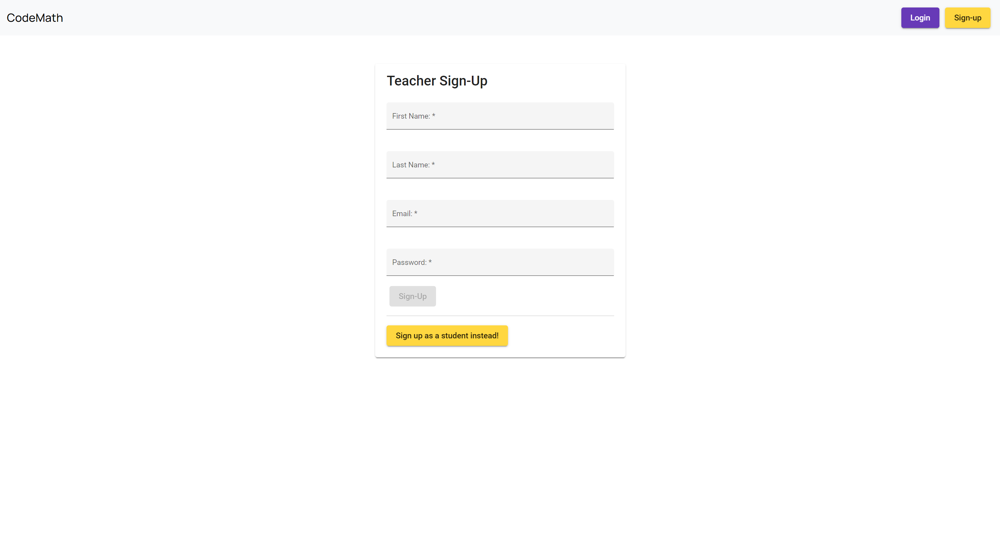
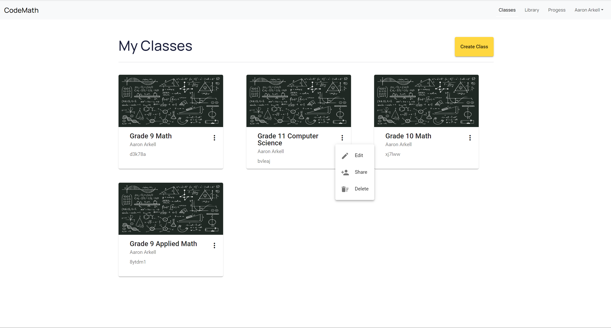
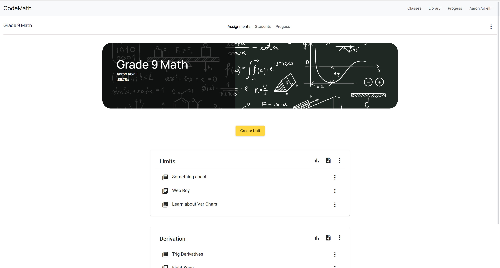

# Code Learning Platform for Grade 9 Math Students
This github folder has the code for the final Java application that I created for this project, before switching to making a web application. Since the website has not been deployed yet and I made its github repository private for now, I have included this as the additional information about this project (addressed to people from Hack The North).

## Basic Idea of this Application
Before getting to the screenshots, I think it's better if I explain my application first. My application is designed to be a learning platform that facilitates math teachers to teach coding (as required by new math curriculums in Ontario). Thus, in my application, teachers can create classes (which students can join through a code), and within those classes, teachers can create units (for particular coding topics, for example). Then, within those units, teachers can create lessons and problems for students to go through.

## Images of Website:
Here are some pictures of the current website I'm building:

Login Page: 

Sign-Up Page:

Classes Page:

Single Class Page:

